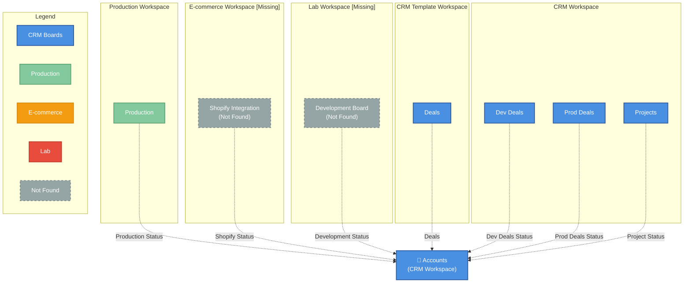

```mermaid
graph TD
    %% Styling
    classDef crmStyle fill:#4a90e2,stroke:#2c5aa0,stroke-width:2px,color:#fff
    classDef productionStyle fill:#82ca9d,stroke:#5da271,stroke-width:2px,color:#fff
    classDef ecommerceStyle fill:#f39c12,stroke:#d68910,stroke-width:2px,color:#fff
    classDef labStyle fill:#e74c3c,stroke:#c0392b,stroke-width:2px,color:#fff
    classDef notFoundStyle fill:#95a5a6,stroke:#7f8c8d,stroke-width:2px,color:#fff,stroke-dasharray: 5 5

    %% Central Node
    Accounts["🏢 Accounts<br/>(CRM Workspace)"]:::crmStyle

    %% Production Workspace
    subgraph "Production Workspace"
        Production["Production"]:::productionStyle
    end

    %% E-commerce Workspace (Not Found)
    subgraph "E-commerce Workspace [Missing]"
        Shopify_Integration["Shopify Integration<br/>(Not Found)"]:::notFoundStyle
    end

    %% Lab Workspace (Not Found)
    subgraph "Lab Workspace [Missing]"
        Development_Board["Development Board<br/>(Not Found)"]:::notFoundStyle
    end

    %% CRM Template Workspace
    subgraph "CRM Template Workspace"
        Deals["Deals"]:::crmStyle
    end

    %% CRM Workspace Connections
    subgraph "CRM Workspace"
        Dev_Deals["Dev Deals"]:::crmStyle
        Prod_Deals["Prod Deals"]:::crmStyle
        Projects["Projects"]:::crmStyle
    end

    %% Mirror Connections
    Production -.->|"Production Status"| Accounts
    Shopify_Integration -.->|"Shopify Status"| Accounts
    Development_Board -.->|"Development Status"| Accounts
    Deals -.->|"Deals"| Accounts
    Dev_Deals -.->|"Dev Deals Status"| Accounts
    Prod_Deals -.->|"Prod Deals Status"| Accounts
    Projects -.->|"Project Status"| Accounts

    %% Legend
    subgraph "Legend"
        L1["CRM Boards"]:::crmStyle
        L2["Production"]:::productionStyle
        L3["E-commerce"]:::ecommerceStyle
        L4["Lab"]:::labStyle
        L5["Not Found"]:::notFoundStyle
    end
```
