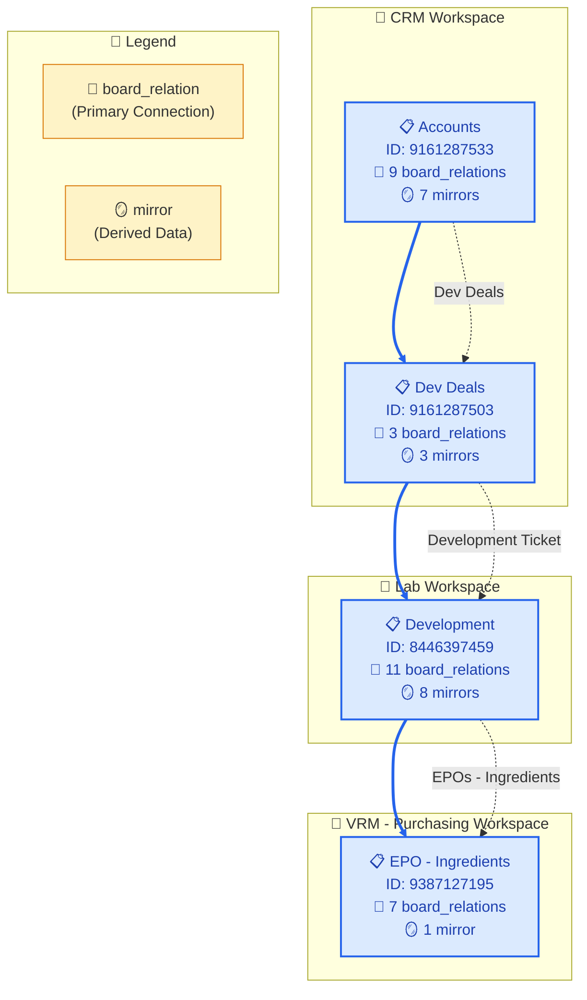

# Board Relation Connection Flow Diagram

Generated: 2025-07-20T21:39:05.597Z
Source: board-relation-flow-trace.json

## 📊 Flow Analysis

### Connection Types Used
- Accounts → Dev Deals: PRIMARY connection via board_relation "Dev Deals"
- Dev Deals → Development: PRIMARY connection via board_relation "Development Ticket"
- Development → EPO - Ingredients: PRIMARY connection via board_relation "EPOs - Ingredients"

### Key Insights
- **Primary Method**: All connections use `board_relation` columns (most reliable)
- **Cross-Workspace Flow**: Spans 3 workspaces (CRM → Lab → VRM - Purchasing)
- **Connection Density**: Each board has multiple `board_relation` connections
- **Data Flow**: Accounts → Dev Deals → Development → EPO - Ingredients

### Board Relation Columns Found

**Accounts** (9 board_relations):
- Contacts → [9161287505, 9409073763]
- PEL-Production → [9304930311]
- PEL - Shopify → [9334295979]
- PEL-Development → [8446397459]
- Dev Deals → [9161287503]
- Prod Deals → [9384243852]
- Projects → [9161287526]
- link to Development → [8446397459]
- link to Finalization → [8887010257]

**Dev Deals** (3 board_relations):
- Development Ticket → [8446397459]
- Contact(s) → [9161287505, 9409073763]
- link to Accounts → [9161287533]

**Development** (11 board_relations):
- Ingredients to Order → [9425451655]
- EPOs - Ingredients → [9387127195]
- EPOs - Materials & Benchmarks → [9454447162]
- PEL - Finalization → [8887010257]
- Dev Deals → [9161287503]
- MO Board - Bulk → [9247212949, 8768285252]
- Prod Deals → [9384243852]
- link to Contacts → [9161287505]
- link to Blockers → [9490857115]
- link to EPOs - Ingredients → [9387127195]
- Accounts → [9161287533]

**EPOs - Ingredients** (7 board_relations):
- Ingredients → [9425451655]
- Production Orders → [9304930311, 8768285252]
- Development → [8446397459]
- Contacts → [9387127114]
- Vendor Accounts → [9387127144]
- link to Bulk Batch Traceability → [8768285252]
- link to Prod Deals → [9384243852]

---
*Generated by trace-board-relation-flow.js*
*Method: board_relation primary navigation*
