# Board Relation Connection Flow Diagram

Generated: 2025-07-20T21:39:05.597Z
Source: board-relation-flow-trace.json

```mermaid
flowchart TD
    %% Define the board relation connection flow
    %% Accounts → Dev Deals → Development → EPO - Ingredients
    
    %% Workspace Subgraphs
    subgraph CRM ["🏢 CRM Workspace"]
        ACC["📋 Accounts<br/>ID: 9161287533<br/>🔗 9 board_relations<br/>🪞 7 mirrors"]
        DEV_DEALS["📋 Dev Deals<br/>ID: 9161287503<br/>🔗 3 board_relations<br/>🪞 3 mirrors"]
    end
    
    subgraph LAB ["🏢 Lab Workspace"]
        DEVELOPMENT["📋 Development<br/>ID: 8446397459<br/>🔗 11 board_relations<br/>🪞 8 mirrors"]
    end
    
    subgraph VRM ["🏢 VRM - Purchasing Workspace"]
        EPO_ING["📋 EPO - Ingredients<br/>ID: 9387127195<br/>🔗 7 board_relations<br/>🪞 1 mirror"]
    end
    
    %% Primary board_relation connections
    ACC ==> DEV_DEALS
    linkStyle 0 stroke:#2563eb,stroke-width:3px
    DEV_DEALS ==> DEVELOPMENT
    linkStyle 1 stroke:#2563eb,stroke-width:3px
    DEVELOPMENT ==> EPO_ING
    linkStyle 2 stroke:#2563eb,stroke-width:3px

    %% Connection Labels
    ACC -.->|"Dev Deals"| DEV_DEALS
    DEV_DEALS -.->|"Development Ticket"| DEVELOPMENT
    DEVELOPMENT -.->|"EPOs - Ingredients"| EPO_ING

    %% Styling
    classDef boardRelation fill:#dbeafe,stroke:#2563eb,stroke-width:2px,color:#1e40af
    classDef workspace fill:#f8fafc,stroke:#64748b,stroke-width:1px
    
    class ACC,DEV_DEALS,DEVELOPMENT,EPO_ING boardRelation
    
    %% Legend
    subgraph LEGEND ["📝 Legend"]
        LEGEND_BR["🔗 board_relation<br/>(Primary Connection)"]
        LEGEND_MR["🪞 mirror<br/>(Derived Data)"]
    end
    
    classDef legend fill:#fef3c7,stroke:#d97706,stroke-width:1px
    class LEGEND_BR,LEGEND_MR legend
```

## 📊 Flow Analysis

### Connection Types Used
- Accounts → Dev Deals: PRIMARY connection via board_relation "Dev Deals"
- Dev Deals → Development: PRIMARY connection via board_relation "Development Ticket"
- Development → EPO - Ingredients: PRIMARY connection via board_relation "EPOs - Ingredients"

### Key Insights
- **Primary Method**: All connections use `board_relation` columns (most reliable)
- **Cross-Workspace Flow**: Spans 3 workspaces (CRM → Lab → VRM - Purchasing)
- **Connection Density**: Each board has multiple `board_relation` connections
- **Data Flow**: Accounts → Dev Deals → Development → EPO - Ingredients

### Board Relation Columns Found

**Accounts** (9 board_relations):
- Contacts → [9161287505, 9409073763]
- PEL-Production → [9304930311]
- PEL - Shopify → [9334295979]
- PEL-Development → [8446397459]
- Dev Deals → [9161287503]
- Prod Deals → [9384243852]
- Projects → [9161287526]
- link to Development → [8446397459]
- link to Finalization → [8887010257]

**Dev Deals** (3 board_relations):
- Development Ticket → [8446397459]
- Contact(s) → [9161287505, 9409073763]
- link to Accounts → [9161287533]

**Development** (11 board_relations):
- Ingredients to Order → [9425451655]
- EPOs - Ingredients → [9387127195]
- EPOs - Materials & Benchmarks → [9454447162]
- PEL - Finalization → [8887010257]
- Dev Deals → [9161287503]
- MO Board - Bulk → [9247212949, 8768285252]
- Prod Deals → [9384243852]
- link to Contacts → [9161287505]
- link to Blockers → [9490857115]
- link to EPOs - Ingredients → [9387127195]
- Accounts → [9161287533]

**EPOs - Ingredients** (7 board_relations):
- Ingredients → [9425451655]
- Production Orders → [9304930311, 8768285252]
- Development → [8446397459]
- Contacts → [9387127114]
- Vendor Accounts → [9387127144]
- link to Bulk Batch Traceability → [8768285252]
- link to Prod Deals → [9384243852]

---
*Generated by trace-board-relation-flow.js*
*Method: board_relation primary navigation*
