# Production Purchasing Flow - Monday Boards & Actions

**Focus**: Monday.com boards and actions for production purchasing workflow

Generated: 2025-07-20
Purpose: Executive visibility into production purchasing from client payment to materials receipt

```mermaid
flowchart LR
    subgraph TRIGGERS ["🎯 TRIGGERS & PREPARATION"]
        PREP["📋 PREPARATION<br/>PO & Spec Sheet signed<br/>Timeline confirmation<br/>Draft POs to vendors"]
        TRIGGER["💰 PAYMENT TRIGGER<br/>Down payment paid<br/>Immediate purchasing"]
    end
    
    subgraph BOARDS ["📋 MONDAY BOARDS WORKFLOW"]
        PROD_DEALS["📋 Prod Deals<br/>CRM Workspace"]
        PRODUCTION["📋 Production<br/>Production Workspace"]
        BULK_BATCH["📋 Bulk Batch<br/>Lab Workspace"]
        EPO_MAT["📋 EPO - Materials<br/>VRM Workspace"]
        EPO_ING["📋 EPO - Ingredients<br/>VRM Workspace"]
    end
    
    subgraph EXTERNAL ["🌐 EXTERNAL & RECEIVING"]
        INFLOW["💸 Inflow PO"]
        VENDORS["🏪 Vendors"]
        RECEIVING["👥 Receiving Team"]
    end
    
    PREP --> PROD_DEALS
    TRIGGER --> PROD_DEALS
    PROD_DEALS --> PRODUCTION
    PRODUCTION --> EPO_MAT
    PRODUCTION --> BULK_BATCH
    BULK_BATCH --> EPO_ING
    EPO_MAT --> INFLOW
    EPO_ING --> INFLOW
    INFLOW --> VENDORS
    VENDORS --> RECEIVING
    RECEIVING --> EPO_MAT
    RECEIVING --> EPO_ING
    
    PROD_ACTIONS["🏭 ACTIONS<br/>Map to production schedule<br/>Set status: Purchasing<br/>Define materials/ingredients"]
    BATCH_ACTIONS["📦 ACTIONS<br/>Plan ingredient requirements<br/>Link to EPO - Ingredients"]
    MAT_ACTIONS["🔧 MATERIALS<br/>Large purchase approvals<br/>Status: Sourcing → Approved"]
    ING_ACTIONS["🧪 INGREDIENTS<br/>Standard EPO workflow<br/>Status: Sourcing → Received"]
    REC_ACTIONS["📥 ACTIONS<br/>Search EPO boards<br/>Mark Received<br/>Upload documentation"]
    
    PROD_ACTIONS -.-> PRODUCTION
    BATCH_ACTIONS -.-> BULK_BATCH
    MAT_ACTIONS -.-> EPO_MAT
    ING_ACTIONS -.-> EPO_ING
    REC_ACTIONS -.-> RECEIVING
    
    classDef mondayBoard fill:#dbeafe,stroke:#2563eb,stroke-width:3px
    classDef external fill:#f3e8ff,stroke:#9333ea,stroke-width:2px
    classDef explanation fill:#fef3c7,stroke:#d97706,stroke-width:2px
    classDef trigger fill:#dcfce7,stroke:#16a34a,stroke-width:2px
    
    class PROD_DEALS,PRODUCTION,BULK_BATCH,EPO_MAT,EPO_ING mondayBoard
    class INFLOW,VENDORS,RECEIVING external
    class PROD_ACTIONS,BATCH_ACTIONS,MAT_ACTIONS,ING_ACTIONS,REC_ACTIONS explanation
    class PREP,TRIGGER trigger
    
    %% Styling
    classDef mondayBoard fill:#dbeafe,stroke:#2563eb,stroke-width:3px,color:#1e40af
    classDef external fill:#f3e8ff,stroke:#9333ea,stroke-width:2px
    classDef explanation fill:#fef3c7,stroke:#d97706,stroke-width:2px,color:#92400e
    classDef trigger fill:#dcfce7,stroke:#16a34a,stroke-width:2px,color:#166534
    classDef preparation fill:#fef2f2,stroke:#dc2626,stroke-width:2px,color:#991b1b
    
    class PROD_DEALS,PRODUCTION,BULK_BATCH,EPO_MATERIALS,EPO_INGREDIENTS mondayBoard
    class INFLOW,VENDORS external
    class PROD_ACTIONS,BULK_ACTIONS,MATERIALS_EPO,INGREDIENTS_EPO,RECEIVING_ACTION,STATUS_PIPELINE explanation
    class TRIGGER trigger
    class PREP_ACTIONS preparation
```

## 📋 Production Purchasing Workflow Summary

### 🎯 Pre-Payment Preparation
**Account Manager & Production Manager Actions**:
- Arrange and get signed Purchase Order and Spec Sheet
- Confirm current purchasing timelines with client
- Send **unpaid draft POs** to vendors for timeline accuracy
- Prepare purchasing requirements before client payment

### 💰 Payment Trigger: "Down payment invoice paid"
**Immediate Purchasing Initiation**:
- Client pays first down payment
- Triggers immediate purchasing execution
- Draft POs already prepared ensure quick turnaround

### 🏭 Production Board Mapping
**Production Team Actions**:
1. **Map Products** to production schedule using draft PO
2. **Set Status** to "Purchasing" in Fulfillment Status
3. **Define Needs** via "Purchasing Needs" column:
   - Materials only
   - Ingredients only  
   - Both ingredients and materials
4. **Link to Bulk Batch** for ingredient tracking

### 📦 Bulk Batch Traceability (Ingredients)
**Batch Planning Actions**:
- Plan ingredient requirements for bulk production
- Link to EPO - Ingredients board
- Track ingredient purchasing status

### 🔧 Materials vs 🧪 Ingredients Purchasing

**Materials EPO Board** (Equipment, packaging, etc.):
- Larger purchase amounts requiring approvals
- Status: Sourcing → Approved → Received
- Often requires management approval for cost

**Ingredients EPO Board** (Formula ingredients):
- Same workflow as development purchasing
- Status: Sourcing → PO sent → Shipped → Received
- Standard purchasing workflow

### 👥 Receiving Process
**Warehouse Team Actions**:
1. **Search EPO Boards** (both Materials and Ingredients)
2. **Locate by vendor/item** when deliveries arrive
3. **Update Status** to "Received"
4. **Upload Documentation** (receiving docs, photos)
5. **Separate Tracking** for materials vs ingredients

## 🔗 Board Connections

- **Prod Deals → Production**: Down payment triggers production mapping
- **Production → EPO Materials**: Materials purchasing requirements
- **Production → Bulk Batch**: Ingredient planning connection
- **Bulk Batch → EPO Ingredients**: Ingredient purchasing requirements

## 📊 Key Differences from Development Purchasing

1. **Pre-Payment Preparation**: Draft POs prepared before client pays
2. **Dual EPO Boards**: Separate materials and ingredients purchasing
3. **Approval Workflow**: Materials may require additional approvals
4. **Production Mapping**: Products mapped to production schedule
5. **Timeline Accuracy**: Pre-confirmed with vendors via draft POs

## 💡 Executive Benefits

- **Fast Turnaround**: Pre-prepared draft POs enable immediate purchasing
- **Dual Tracking**: Materials and ingredients tracked separately
- **Timeline Accuracy**: Vendor timelines confirmed before client commitment
- **Production Ready**: Clear visibility into what's needed for production
- **Approval Control**: Large material purchases routed through approval workflow

---
*Production Purchasing Flow Diagram*
*Focus: Client payment to materials/ingredients receipt*